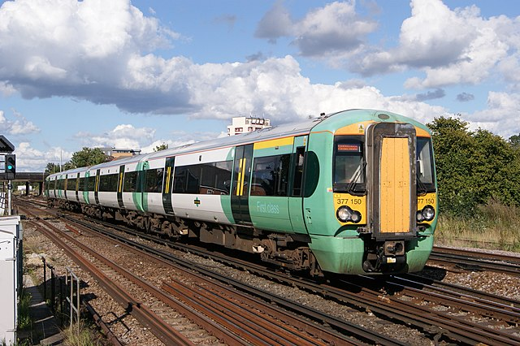

# [British Rail Class 377 "Electrostar"](https://en.wikipedia.org/wiki/British_Rail_Class_377)
  
(image credit: [Flickr / Hugh Llewelyn](https://www.flickr.com/photos/camperdown/20870385584/))
## [(open issues)](https://github.com/BenjaminEHowe/nimby-rails-mods/labels/trains%2Fbr-377) [(view on Steam)](https://steamcommunity.com/sharedfiles/filedetails/?id=2398188034)

## Description

The British Rail Class 377 Electrostar is a British dual-voltage electric multiple-unit passenger train (EMU) built by Bombardier Transportation at its Derby Litchurch Lane Works from 2001 to 2014. The Electrostar family is the most numerous type of EMU built in the post-privatisation period of Britain's railways.

(source: [Wikipedia](https://en.wikipedia.org/wiki/British_Rail_Class_377))

## Changelog

### 2021-02-16T21:59:22

- Initial release
